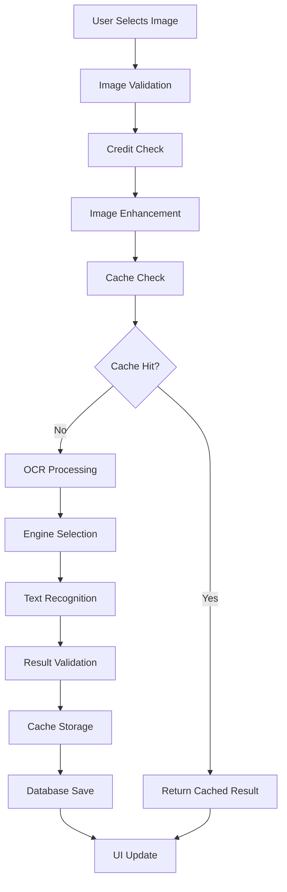
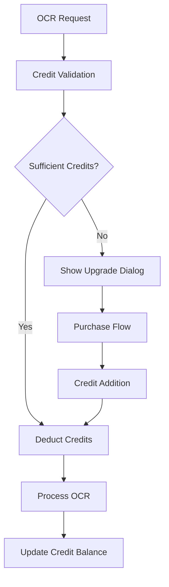
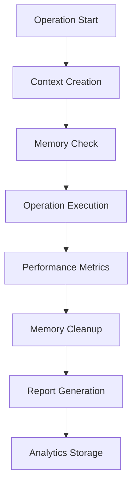

# Lensify OCR Scanner - Architecture Documentation

## 🏗️ System Overview

Lensify OCR Scanner is a Flutter-based mobile application that provides advanced Optical Character Recognition (OCR) capabilities with a freemium business model. The application is designed with scalability, performance, and user experience in mind.

## 📋 Table of Contents

1. [Architecture Principles](#architecture-principles)
2. [System Architecture](#system-architecture)
3. [Data Flow](#data-flow)
4. [Component Design](#component-design)
5. [Performance Considerations](#performance-considerations)
6. [Security Architecture](#security-architecture)
7. [Testing Strategy](#testing-strategy)
8. [Deployment Architecture](#deployment-architecture)

## 🎯 Architecture Principles

### 1. Separation of Concerns
- **UI Layer**: Pure presentation logic
- **Business Logic Layer**: Core OCR and business operations
- **Data Layer**: Local storage and caching
- **Service Layer**: External integrations (AdMob, IAP)

### 2. Dependency Injection
- Provider pattern for state management
- Service locator for singleton services
- Constructor injection for dependencies

### 3. Error Handling
- Centralized error handling with `ErrorHandler`
- Graceful degradation for offline scenarios
- User-friendly error messages

### 4. Performance First
- Lazy loading of heavy components
- Intelligent caching strategies
- Memory management for large images
- Background processing for batch operations

## 🏛️ System Architecture

### High-Level Architecture

```
┌─────────────────────────────────────────────────────────────┐
│                    Presentation Layer                      │
├─────────────────────────────────────────────────────────────┤
│  Screens (UI)  │  Widgets  │  Animations  │  Theme       │
└─────────────────────────────────────────────────────────────┘
                              │
┌─────────────────────────────────────────────────────────────┐
│                   Business Logic Layer                     │
├─────────────────────────────────────────────────────────────┤
│ OCR Engine │ Credit Mgr │ Performance │ Cache Mgr │ Error │
│   Manager  │            │   Monitor   │           │Handler│
└─────────────────────────────────────────────────────────────┘
                              │
┌─────────────────────────────────────────────────────────────┐
│                     Data Layer                            │
├─────────────────────────────────────────────────────────────┤
│ SQLite DB │ Shared Prefs │ File System │ Memory Cache     │
└─────────────────────────────────────────────────────────────┘
                              │
┌─────────────────────────────────────────────────────────────┐
│                   Service Layer                           │
├─────────────────────────────────────────────────────────────┤
│ AdMob │ IAP │ Widget │ Cloud Vision │ Google ML Kit      │
└─────────────────────────────────────────────────────────────┘
```

### Component Architecture

#### 1. Core Components

**OCR Engine Manager** (`lib/utils/ocr_engine_manager.dart`)
```dart
class OCREngineManager {
  // Multi-engine OCR processing
  static Future<OCRResult> performOCR(File imageFile, {
    OCRQuality quality = OCRQuality.balanced,
    String language = 'tur',
    bool isHandwritingMode = false,
  })
  
  // Engine selection strategy
  static OCREngine _selectEngine(OCRQuality quality, bool isHandwriting)
  
  // Performance optimization
  static Future<OCRResult> _performOptimizedOCR(File imageFile, OCREngine engine)
}
```

**Credit Manager** (`lib/services/credit_manager.dart`)
```dart
class CreditManager {
  // Credit validation and usage
  Future<bool> useOCRCredits({
    required OCRType type,
    required int imageCount,
    required bool isHandwriting,
    required bool isPremiumQuality,
  })
  
  // Subscription management
  Future<void> loadSubscriptionStatus()
  
  // Credit analytics
  Future<CreditAnalytics> getCreditAnalytics()
}
```

**Performance Monitor** (`lib/utils/performance_monitor.dart`)
```dart
class PerformanceMonitor {
  // Real-time performance tracking
  Future<T> trackOCROperation<T>(Future<T> Function() operation, OCROperationContext context)
  
  // Memory usage monitoring
  Future<void> checkMemoryUsage()
  
  // Performance analytics
  Future<PerformanceReport> generateReport()
}
```

#### 2. Data Management

**Cache Manager** (`lib/utils/ocr_cache_manager.dart`)
```dart
class OCRCacheManager {
  // Intelligent caching with config-based keys
  Future<OCRResult?> getCachedResult(File imageFile, OCRCacheConfig config)
  
  // Cache invalidation strategies
  Future<void> invalidateCache(OCRCacheConfig config)
  
  // Storage optimization
  Future<void> cleanupOldCache()
}
```

**Database Manager** (`lib/database/ocr_history_database.dart`)
```dart
class OCRHistoryDatabase {
  // SQLite operations with RLS
  Future<void> saveOCRResult(OCRHistoryEntry entry)
  
  // Query with pagination
  Future<List<OCRHistoryEntry>> getOCRHistory({int limit = 50, int offset = 0})
  
  // Analytics queries
  Future<DatabaseAnalytics> getAnalytics()
}
```

#### 3. UI Components

**Theme Provider** (`lib/theme/theme_provider.dart`)
```dart
class ThemeProvider extends ChangeNotifier {
  // Theme management with localization
  ThemeData getTheme(BuildContext context)
  
  // Dynamic theme switching
  Future<void> switchTheme(ThemeMode mode)
  
  // Locale management
  Future<void> setLocale(Locale locale)
}
```

## 🔄 Data Flow

### OCR Processing Flow



### Credit System Flow



### Performance Monitoring Flow



## 🎨 Component Design

### 1. OCR Engine Strategy Pattern

```dart
abstract class OCREngine {
  Future<OCRResult> process(File imageFile, String language);
  String get displayName;
  bool get isAvailable;
}

class GoogleMLKitEngine implements OCREngine {
  @override
  Future<OCRResult> process(File imageFile, String language) async {
    // Google ML Kit implementation
  }
}

class TesseractEngine implements OCREngine {
  @override
  Future<OCRResult> process(File imageFile, String language) async {
    // Tesseract implementation
  }
}
```

### 2. Cache Strategy Pattern

```dart
abstract class CacheStrategy {
  Future<OCRResult?> get(File imageFile, OCRCacheConfig config);
  Future<void> set(File imageFile, OCRResult result, OCRCacheConfig config);
  Future<void> invalidate(OCRCacheConfig config);
}

class MemoryCacheStrategy implements CacheStrategy {
  // In-memory caching
}

class DiskCacheStrategy implements CacheStrategy {
  // Disk-based caching
}
```

### 3. Error Handling Strategy

```dart
class ErrorHandler {
  static void handleError(
    BuildContext context,
    dynamic error, {
    String? customMessage,
    VoidCallback? onRetry,
    bool showSnackBar = true,
  })
  
  static void showSuccess(BuildContext context, String message)
  static void showInfo(BuildContext context, String message)
}
```

## ⚡ Performance Considerations

### 1. Memory Management

**Image Processing**
- Automatic image resizing for large files
- Memory pool for image processing
- Garbage collection optimization

**Cache Management**
- LRU (Least Recently Used) cache eviction
- Size-based cache limits
- Automatic cache cleanup

### 2. Processing Optimization

**Batch Processing**
- Parallel processing with controlled concurrency
- Progress tracking for user feedback
- Memory-efficient batch operations

**Engine Selection**
- Quality-based engine selection
- Performance-based fallback strategies
- Caching of engine results

### 3. UI Performance

**Animation Optimization**
- Hardware-accelerated animations
- Frame rate monitoring
- Animation cancellation on navigation

**State Management**
- Efficient Provider usage
- Minimal rebuild strategies
- Memory leak prevention

## 🔒 Security Architecture

### 1. Data Protection

**Local Storage**
- Encrypted SharedPreferences
- Secure file storage
- Database encryption

**API Security**
- Secure API key storage
- Request signing
- Rate limiting

### 2. Privacy

**Data Minimization**
- No unnecessary data collection
- Local processing where possible
- User consent for data usage

**Secure Communication**
- HTTPS for all network requests
- Certificate pinning
- Secure WebSocket connections

### 3. Access Control

**Permission Management**
- Runtime permission requests
- Graceful permission denial handling
- Permission explanation dialogs

## 🧪 Testing Strategy

### 1. Unit Testing

**Core Logic Testing**
```dart
void main() {
  group('OCR Engine Manager Tests', () {
    test('should select correct engine for quality level', () {
      // Test implementation
    });
    
    test('should handle OCR errors gracefully', () {
      // Test implementation
    });
  });
}
```

**Service Testing**
```dart
void main() {
  group('Credit Manager Tests', () {
    test('should validate credits correctly', () {
      // Test implementation
    });
    
    test('should handle insufficient credits', () {
      // Test implementation
    });
  });
}
```

### 2. Widget Testing

**UI Component Testing**
```dart
void main() {
  group('OCR Home Page Tests', () {
    testWidgets('should display image picker buttons', (tester) async {
      // Test implementation
    });
    
    testWidgets('should handle image selection', (tester) async {
      // Test implementation
    });
  });
}
```

### 3. Integration Testing

**End-to-End Testing**
```dart
void main() {
  group('OCR Flow Tests', () {
    testWidgets('should complete full OCR flow', (tester) async {
      // Test implementation
    });
  });
}
```

## 🚀 Deployment Architecture

### 1. Build Configuration

**Android Configuration**
```kotlin
android {
    compileSdkVersion 34
    defaultConfig {
        minSdkVersion 21
        targetSdkVersion 34
        versionCode 3
        versionName "1.1.0"
    }
    
    buildTypes {
        release {
            minifyEnabled true
            proguardFiles getDefaultProguardFile('proguard-android-optimize.txt')
        }
    }
}
```

**iOS Configuration**
```swift
// Info.plist configurations
// App capabilities
// Signing and provisioning
```

### 2. CI/CD Pipeline

**GitHub Actions Workflow**
```yaml
name: Build and Test
on: [push, pull_request]

jobs:
  test:
    runs-on: ubuntu-latest
    steps:
      - uses: actions/checkout@v3
      - uses: subosito/flutter-action@v2
      - run: flutter test
      - run: flutter build apk --release
```

### 3. Release Management

**Version Control**
- Semantic versioning
- Changelog maintenance
- Release notes generation

**Store Deployment**
- Automated build generation
- Store listing management
- A/B testing support

## 📊 Monitoring and Analytics

### 1. Performance Monitoring

**Metrics Collection**
- OCR processing time
- Memory usage patterns
- Cache hit rates
- Error rates

**Alerting**
- Performance degradation alerts
- Error rate thresholds
- Memory usage warnings

### 2. User Analytics

**Usage Tracking**
- Feature usage statistics
- User journey analysis
- Conversion funnel tracking

**Business Metrics**
- Revenue tracking
- Subscription analytics
- User retention rates

## 🔄 Future Enhancements

### 1. Scalability Improvements

**Microservices Architecture**
- Separate OCR processing service
- Distributed caching
- Load balancing

**Cloud Integration**
- Cloud OCR processing
- Real-time collaboration
- Multi-device sync

### 2. Advanced Features

**AI Enhancements**
- Machine learning for OCR accuracy
- Intelligent image preprocessing
- Context-aware text recognition

**Collaboration Features**
- Team workspaces
- Shared document processing
- Real-time collaboration

### 3. Platform Expansion

**Web Application**
- Progressive Web App (PWA)
- Cross-platform compatibility
- Desktop application

**API Services**
- RESTful API for third-party integration
- Webhook support
- Developer documentation

---

This architecture documentation provides a comprehensive overview of the Lensify OCR Scanner's design principles, component structure, and implementation strategies. It serves as a guide for developers, maintainers, and stakeholders to understand the system's complexity and make informed decisions about future enhancements. 