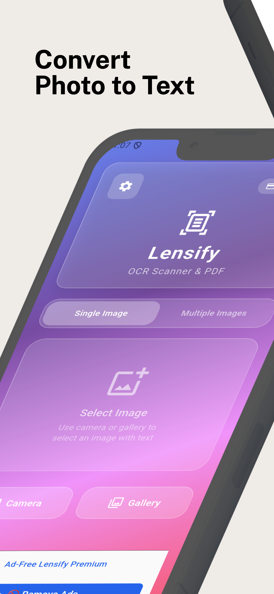
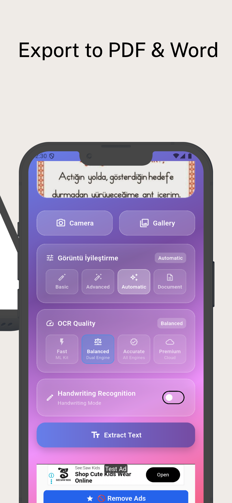
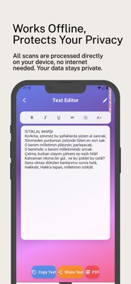
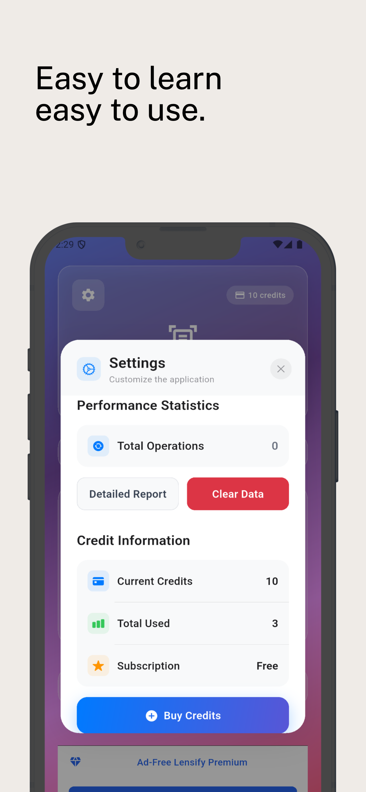

# Lensify OCR Scanner 📸

[](https://flutter.dev/)
[](https://dart.dev/)
[](LICENSE)
[](pubspec.yaml)

> Professional OCR Scanner & PDF Generator with advanced text recognition capabilities

## 🚀 Features

### Core OCR Capabilities
- **Multi-Engine OCR**: Google ML Kit, Tesseract, and Cloud Vision API
- **Batch Processing**: Process multiple images simultaneously
- **Handwriting Recognition**: Specialized engine for handwritten text
- **Quality Modes**: Fast, Balanced, Accurate, and Premium options
- **Image Enhancement**: Auto, Basic, Advanced, and Document modes

### Advanced Features
- **Smart Caching**: Intelligent result caching for improved performance
- **Memory Management**: Optimized memory usage for large images
- **Performance Monitoring**: Real-time performance tracking
- **Error Handling**: Comprehensive error handling with retry mechanisms
- **Offline Support**: Core functionality works without internet

### User Experience
- **Modern UI**: Beautiful gradient design with glass morphism effects
- **Dark/Light Theme**: Automatic theme switching
- **Animations**: Smooth animations and transitions
- **Localization**: Multi-language support (EN/TR)
- **Accessibility**: Full accessibility support

### User Experience
- **Modern UI**: Beautiful gradient design with glass morphism effects
- **Dark/Light Theme**: Automatic theme switching
- **Animations**: Smooth animations and transitions
- **Localization**: Multi-language support (EN/TR)
- **Accessibility**: Full accessibility support

## 📱 Screenshots

<div align="center">
  
  
  
  
  
</div>

> **Note:** If screenshots don't load, please refresh the page or check the [screenshots folder](./screenshots/) directly.

## 🏗️ Architecture

### Project Structure
```
lib/
├── animations/          # Animation utilities
├── database/           # SQLite database operations
├── l10n/              # Localization files
├── screens/            # App screens
├── services/           # Business logic services
├── theme/              # Theme and styling
├── utils/              # Utility functions
├── widgets/            # Reusable UI components
├── main.dart           # App entry point
├── settings_dialog.dart # Settings UI
└── text_editor_screen.dart # Text editing screen
```

### Key Components

#### OCR Engine Manager (`lib/utils/ocr_engine_manager.dart`)
- Multi-engine OCR processing
- Quality-based strategy selection
- Handwriting recognition support
- Performance optimization

#### Performance Monitor (`lib/utils/performance_monitor.dart`)
- Real-time performance tracking
- Memory usage monitoring
- Operation timing
- Performance analytics

#### Performance Monitor (`lib/utils/performance_monitor.dart`)
- Real-time performance tracking
- Memory usage monitoring
- Operation timing
- Performance analytics

#### Cache Manager (`lib/utils/ocr_cache_manager.dart`)
- Intelligent result caching
- Cache invalidation strategies
- Storage optimization
- Hit rate tracking

## 🛠️ Installation

### Prerequisites
- Flutter SDK 3.7.2 or higher
- Dart SDK 3.0 or higher
- Android Studio / VS Code
- Android SDK (for Android development)
- Xcode (for iOS development)

### Setup Instructions

1. **Clone the repository**
   ```bash
   git clone https://github.com/yourusername/lensify-ocr-scanner.git
   cd lensify-ocr-scanner
   ```

2. **Install dependencies**
   ```bash
   flutter pub get
   ```

3. **Configure environment variables**
   ```bash
   # Create .env.local file
   cp .env.example .env.local
   # Edit .env.local with your API keys
   ```

4. **Run the app**
   ```bash
   # For Android
   flutter run -d android
   
   # For iOS
   flutter run -d ios
   ```

### Environment Variables

Create a `.env.local` file with the following variables:

```env
# Google Cloud Vision API (Optional)
GOOGLE_CLOUD_VISION_API_KEY=your_cloud_vision_api_key

# Debug Mode
NEXT_PUBLIC_DEBUG_MODE=true
DEBUG_MODE=true
```

## 🔧 Configuration

### OCR Quality Settings

The app supports four OCR quality modes:

1. **Fast** (Google ML Kit only)
   - Quickest processing
   - Good for simple text
   - Free processing

2. **Balanced** (Dual engine)
   - ML Kit + Tesseract
   - Best value for accuracy
   - Free processing

3. **Accurate** (All engines)
   - All available engines
   - Highest accuracy
   - Free processing

4. **Premium** (Cloud Vision)
   - Cloud Vision API included
   - Maximum accuracy
   - Free processing

### Image Enhancement Levels

1. **Auto**: Automatic enhancement based on image analysis
2. **Basic**: Light enhancement for clear images
3. **Advanced**: Strong enhancement for poor quality images
4. **Document**: Specialized for document scanning

## 🧪 Testing

### Unit Tests
```bash
flutter test
```

### Widget Tests
```bash
flutter test test/widget_test.dart
```

### Integration Tests
```bash
flutter drive --target=test_driver/app.dart
```

### Performance Testing
```bash
flutter run --profile
flutter run --release
```

## 📊 Performance Metrics

### Current Performance
- **OCR Processing**: 2-5 seconds per image
- **Memory Usage**: <100MB for typical usage
- **Cache Hit Rate**: ~70% for repeated scans
- **App Size**: ~25MB (Android), ~35MB (iOS)

### Optimization Strategies
- Intelligent caching system
- Memory management for large images
- Background processing for batch operations
- Lazy loading of OCR engines

## 🔒 Security

### Data Protection
- No data sent to servers (except Cloud Vision API)
- Local storage encryption
- Secure API key management
- Privacy-first design

### Permissions
- Camera: For taking photos
- Storage: For accessing gallery images
- Internet: For Cloud Vision API (premium feature)

## 📈 Analytics & Monitoring

### Performance Monitoring
- Real-time operation tracking
- Memory usage monitoring
- Cache performance metrics
- Error rate tracking

### User Analytics
- Feature usage statistics
- Performance metrics
- Error reporting
- User behavior analysis

## 🚀 Deployment

### Android Release
```bash
# Build APK
flutter build apk --release

# Build App Bundle
flutter build appbundle --release
```

### iOS Release
```bash
# Build iOS
flutter build ios --release

# Archive for App Store
xcodebuild -workspace ios/Runner.xcworkspace -scheme Runner archive
```

### Play Store Deployment
1. Update version in `pubspec.yaml`
2. Build release APK/Bundle
3. Upload to Google Play Console
4. Configure store listing with screenshots

## 🤝 Contributing

### Development Guidelines
1. Follow Flutter best practices
2. Use meaningful commit messages
3. Write tests for new features
4. Update documentation
5. Follow the existing code style

### Code Style
- Use `flutter_lints` for code quality
- Follow Dart style guide
- Use meaningful variable names
- Add comments for complex logic

### Pull Request Process
1. Fork the repository
2. Create a feature branch
3. Make your changes
4. Add tests if applicable
5. Update documentation
6. Submit a pull request

## 📄 License

This project is licensed under the MIT License - see the [LICENSE](LICENSE) file for details.

## 🙏 Acknowledgments

- [Google ML Kit](https://developers.google.com/ml-kit) for OCR capabilities
- [Tesseract](https://github.com/tesseract-ocr/tesseract) for offline OCR
- [Flutter](https://flutter.dev/) for the amazing framework
- [Google Cloud Vision API](https://cloud.google.com/vision) for premium OCR

## 📞 Support

- **Email**: support@lensify.app
- **Website**: https://lensify.app
- **Documentation**: https://docs.lensify.app
- **Issues**: [GitHub Issues](https://github.com/yourusername/lensify-ocr-scanner/issues)

## 🔄 Changelog

### Version 1.1.0+3
- ✨ Added batch processing feature
- ✨ Implemented handwriting recognition
- ✨ Added performance monitoring
- ✨ Enhanced caching system
- 🐛 Fixed memory leaks
- 🐛 Improved error handling
- 📱 Added widget support
- 🌙 Enhanced dark mode

### Version 1.0.0+1
- 🎉 Initial release
- ✨ Basic OCR functionality
- ✨ PDF generation
- ✨ Credit system
- ✨ AdMob integration

---

<div align="center">
  <p>Made with ❤️ by the Lensify Team</p>
  <p>Professional OCR Scanner for everyone</p>
</div> 